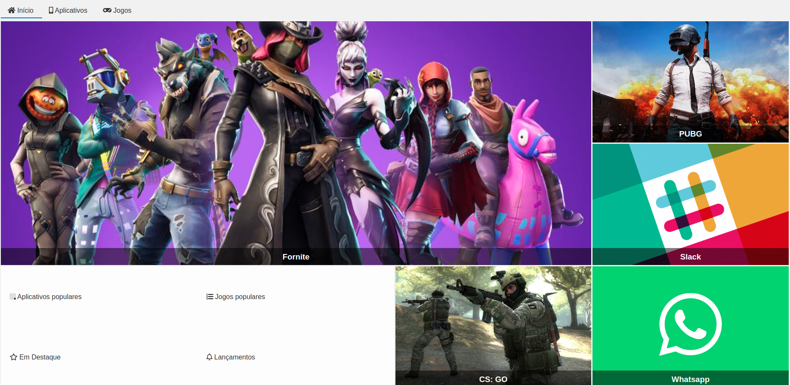

# Alura Store

---

Esse projeto consiste de uma página WEB estática responsiva construída com HTML5 e CSS3 simulando uma página de compra de jogos.

---

Projeto desenvolvido no curso de CSS Grid da Alura.
